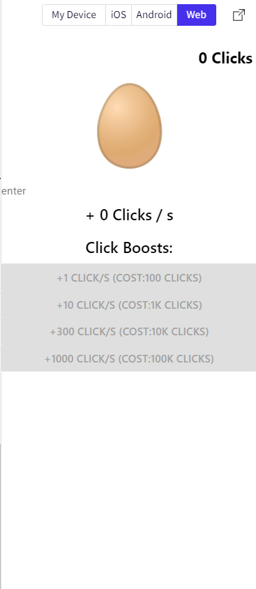

#  Class Name: CS455

 Web-address:https://snack.expo.dev/@uofrjimmy/finalexam 
 
 Last Modified date:April 22 2022

# Menu

1. [Interface](#Interface)

2. [Tutorial](#Tutorial)

## Interface

## Tutorial

This an egg clicker game. Player will earn the clicks by clicking the egg. Player can buy clicks boosting if player have certain amount of clicks. The clicks boosting will automatically increase the clicks amount for player ever second. The winning condition is 1 quadrillion clicks. There is a pop up window show up if player reach winning condition. Everything will reset if player win.

### Winning image

